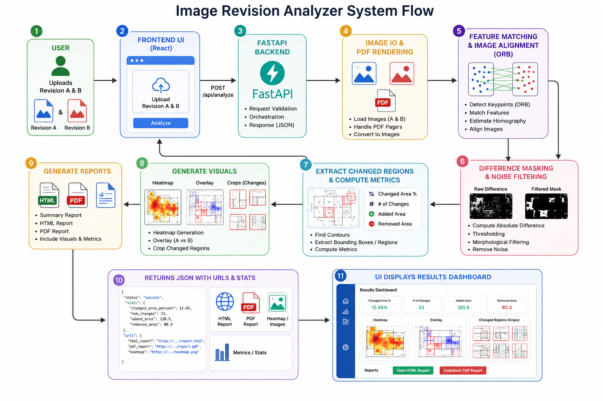

# i2i - comparisons (Visual Drawing Review)

A comprehensive, full-stack application for detecting, analyzing, and summarizing visual changes between two site photos, engineering drawings, or static image PDFs. 

The output is tailored specifically for civil engineers and reviewers: changed regions are automatically detected and bounded, affected areas are estimated, image evidence is extracted, and both HTML and PDF reports are generated to explain the results in inspection-friendly language.

## Key Features

* **Multi-Format Support:** Seamlessly upload JPG, JPEG, PNG, or PDF files. The backend automatically renders the first page of uploaded PDFs for comparison.
* **Intelligent Image Alignment:** Uses advanced computer vision feature-matching techniques (ORB) to automatically align and register images if they are slightly shifted, rotated, or scaled differently.
* **Precision Difference Detection:** Uses OpenCV image subtraction and morphological noise filtering to isolate genuine changes while ignoring minor artifacts.
* **Detailed Visual Outputs:** Automatically generates a suite of visuals to help reviewers understand the changes:
  * Side-by-side comparisons
  * Difference heatmaps
  * Bounding-box overlays on the original image
  * Binary difference masks
  * Specific cropped views (Before, After, and Mask) for every individual detected change
* **Engineering Metrics & Heuristics:** Computes changed region counts, total affected area percentage, changed pixels, confidence scores, and bounding box coordinates. It uses aspect-ratio heuristics to guess the type of structural change (e.g., "Possible Window", "Possible Door").
* **Automated Reporting:** Generates comprehensive, downloadable **HTML and PDF** summary reports containing the analysis, engineering summary, and visual evidence.
* **Local Direct Downloads:** The UI enables 1-click native downloads for generated PDF and HTML reports.
* **Professional UI:** A responsive, modern React interface styled with a custom subtle, earthy green palette for a premium, accessible feel.

## System Architecture Flowchart



##  Project Structure

```text
backend/
  app/
    main.py                 FastAPI routes & entrypoint
    services/
      difference.py         Alignment, masking, region extraction, and visualizations
      image_io.py           Image/PDF upload validation, decoding, and preprocessing
      report.py             PDF and HTML report generation
      summary.py            Civil engineering natural-language summary generator
frontend/
  src/
    main.jsx                React application containing the visual review dashboard
    styles.css              Responsive UI styling (Subtle Green Palette)
docs/
  requirements.md
  architecture.md
scripts/
  generate_samples.py       Generates sample drawing images for testing
```

## Setup & Installation

### Backend Setup

```bash
cd backend
python -m venv .venv

# Windows
.venv\Scripts\activate
# Mac/Linux
source .venv/bin/activate

pip install -r requirements.txt

# Run the backend
python -m uvicorn app.main:app --reload --host 127.0.0.1 --port 8000
```

### Frontend Setup

```bash
cd frontend
npm install
npm run dev
```
Once both servers are running, open `http://127.0.0.1:5173` in your browser.

##  Testing with Sample Inputs

If you don't have engineering drawings on hand, you can generate simulated construction drawings to test the pipeline:
```bash
python scripts/generate_samples.py
```
This creates two sample drawing images in `samples/` which you can upload via the web UI.

##  API Reference

### `POST /api/analyze`

**Request:** Multipart form data
* `reference`: The original JPG, JPEG, PNG, or PDF file (Revision A).
* `comparison`: The updated JPG, JPEG, PNG, or PDF file (Revision B).

**Response:** JSON
Returns URLs for the original image, aligned comparison, side-by-side view, heatmap, bounding box overlay, binary mask, individual region crops, HTML report, and PDF report. It also includes comprehensive region statistics, bounding coordinates, and a generated engineering summary.

## References

The project brief requires awareness of these resources:

- https://arxiv.org/abs/2201.00625
- https://arxiv.org/pdf/2505.01530
- https://github.com/javvi51/eDOCr
- https://github.com/Bakkopi/engineering-drawing-extractor
- https://github.com/topics/cad-drawings

This implementation leverages practical, robust computer-vision techniques to deliver a highly reliable prototype while keeping the architecture open for future model-based object recognition or specialized drawing-element extraction integrations.
