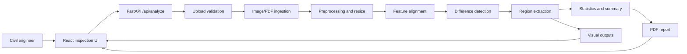

# System Architecture

## Backend

FastAPI exposes a single analysis endpoint plus static result serving. Uploaded images are decoded with Pillow. Uploaded PDFs are rendered with PyMuPDF. OpenCV performs alignment, difference masking, morphology, contour extraction, and visual rendering.

## Frontend

React provides a focused dashboard for civil inspection:

- two upload controls
- run-analysis action
- engineer summary
- metric tiles
- visual evidence grid
- changed-region register
- report download

## Data Flow

1. User uploads a reference file and comparison file.
2. FastAPI validates type and size.
3. PDF inputs are rendered to images; image inputs are decoded directly.
4. Both images are resized to a common canvas.
5. ORB features attempt alignment of the comparison image to the reference.
6. A grayscale difference image is thresholded and filtered.
7. Contours become changed-region bounding boxes.
8. Visual outputs and a report PDF are written under `backend/app/static/results/{job_id}`.
9. The API returns output URLs, statistics, coordinates, and summary text.

## Extension Points

- Add deep-learning semantic segmentation for civil assets.
- Add OCR/CAD symbol recognition for drawing sheets.
- Compare all PDF pages instead of only the first page.
- Store jobs in a database for audit history.
- Add authentication for project teams.
